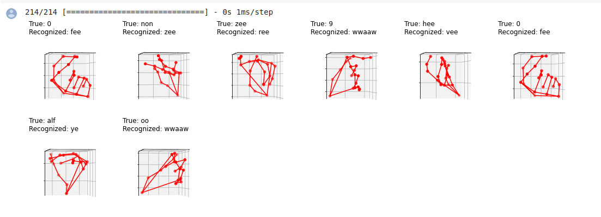

* what is sign language?
    * how sign language communication works?
    * important of sign language in field of machine leanring?

* how sign language work?
    * how sign language work using deep neural network?
    

* our challenge that we should do it to get good real-time sign langauge recognition?
    1. collecting good dataets:
        * our dataset collection containing:
            * 14,500 sign image for each class
            * 623,500 sign for all classes
            

    2. cleaning the dataset:
        * dataset cleaned using manuall cleaning by finding wrong sign or wrong label and removing it or correct it by moving it to the right label.
    
    3. landmark the image:
        * landmarking the hand collecting using open source tool mediapipe.
        

    4. finding good model for our dataset:
        * our choice for training the model is CNN (Convusion Neural Network)

        * model accuracy
        

        * confusion matrix for my big model
        

        * confusion matrix for tflite
        

        * most wrong hand:
        

* conclusion
    * talk about the summary of the work.

* feature work
    * talk about this idea that you have in the feature of your research
    